<p align="center">
  
</p>

<h1 align="center">Streetwise</h1>

<p align="center">
  <strong>🚶‍♂️ The Waze for Safe Walking</strong><br/>
  Real-time community-powered safety navigation for pedestrians
</p>

<p align="center">
  <a href="https://streetwise.vercel.app"></a>
  <a href="#-quick-start"></a>
  <a href="https://github.com/Owusu1946/streetwise/issues"></a>
</p>

<p align="center">
  
  
  
  
  
</p>

---

## 📑 Table of Contents

- [🎯 Overview](#-overview)
- [✨ Features](#-features)
  - [Navigation & Maps](#️-navigation--maps)
  - [Safety Features](#-safety-features)
  - [Troski Mode](#-troski-mode-ghana-public-transport)
  - [Emergency SOS](#-emergency-sos)
- [🏗️ Architecture](#️-architecture)
- [🛡️ Safety Algorithm](#️-safety-algorithm)
- [🚀 Quick Start](#-quick-start)
- [⚙️ Configuration](#️-configuration)
- [📱 PWA Installation](#-pwa-installation)
- [🗄️ Database Schema](#️-database-schema)
- [🤝 Contributing](#-contributing)
- [📄 License](#-license)

---

## 🎯 Overview

Streetwise is a Progressive Web App (PWA) that makes urban walking safer through **crowdsourced incident reporting**, **intelligent route scoring**, and **real-time navigation**. Think of it as **Waze, but for pedestrians**.

### The Problem

Urban pedestrians face safety challenges daily:
- 🌑 Poorly lit streets at night
- ⚠️ Areas with high incident rates
- 📍 Unfamiliar neighborhoods
- 🚨 No quick access to emergency services

### Our Solution

Streetwise provides:
- **Safety-scored routes** based on real incidents, lighting, and police proximity
- **Community reporting** to alert others of dangers in real-time
- **One-tap emergency features** including police navigation and fake calls
- **Offline-ready PWA** that works even with limited connectivity

---

## ✨ Features

### 🗺️ Navigation & Maps

| Feature | Description |
|---------|-------------|
| **Smart Route Planning** | Choose between fastest or safest routes with visual safety scores |
| **Turn-by-Turn Navigation** | Voice-ready step-by-step directions with maneuver icons |
| **Live Location Tracking** | Continuous GPS with smooth animated marker updates |
| **Progress Bar** | Visual journey completion percentage with ETA |
| **Speed Display** | Real-time speed with activity detection (Walking/Jogging/Cycling/Driving) |
| **3D Map Mode** | Tilted perspective for better spatial awareness |
| **Satellite Toggle** | Switch between standard and satellite views |
| **Click-to-Navigate** | Tap anywhere on the map to start navigation |

### 🛡️ Safety Features

| Feature | Description |
|---------|-------------|
| **Incident Reporting** | Report dangers in real-time: theft, harassment, accidents, etc. |
| **Safety Scoring** | Routes scored 1-10 based on multiple safety factors |
| **Danger Zone Avoidance** | Automatic alternative routes around high-risk areas |
| **Police Station Markers** | See all nearby stations with distance info |
| **Street Lighting Analysis** | Route scoring includes street light coverage data |
| **Weather Awareness** | Current conditions widget for trip planning |

### 🚌 Troski Mode (Ghana Public Transport)

| Feature | Description |
|---------|-------------|
| **Route Discovery** | Find Trotro/minibus routes to any destination |
| **Community Routes** | Add and share local transport routes |
| **Smart Boarding** | Find the closest stop to reduce walking distance |
| **Fare Estimates** | See expected costs for each journey |
| **Walking Directions** | Get directions to the nearest stop |

### 🚨 Emergency SOS

| Feature | Description |
|---------|-------------|
| **One-Tap Emergency Call** | Hold to call emergency services (911/police) |
| **Police Navigation** | Instant routing to the nearest police station |
| **Alert Contacts** | Send location SMS to up to 3 emergency contacts |
| **Fake Call** | Simulate an incoming call to escape uncomfortable situations |
| **AI Companion** | ElevenLabs-powered voice agent for the fake call feature |

---

## 🏗️ Architecture

### System Overview

```mermaid
graph TB
    subgraph Client["📱 Client (PWA)"]
        UI["React Components"]
        Maps["Google Maps SDK"]
        SW["Service Worker"]
    end

    subgraph API["⚡ Next.js API Routes"]
        Directions["Directions API"]
        Safety["Safety Calculator"]
        Incidents["Incident Handler"]
        Police["Police Locator"]
    end

    subgraph External["🌐 External Services"]
        GMaps["Google Maps Platform"]
        ElevenLabs["ElevenLabs Voice AI"]
        Weather["OpenWeather API"]
    end

    subgraph Database["🗄️ Supabase"]
        PostGIS["PostGIS"]
        Tables["Tables"]
    end

    UI --> Maps
    UI --> API
    Maps --> GMaps
    API --> Database
    API --> External
    SW --> UI
```



### Navigation Flow


### Tech Stack


---

## 🛡️ Safety Algorithm

Our intelligent routing system analyzes multiple factors to calculate a **Safety Score** from 1-10:

### Scoring Factors

| Factor | Weight | Description |
|--------|:------:|-------------|
| 🚨 **Incidents** | 40% | Recent community-reported dangers along route |
| 👮 **Police Proximity** | 25% | Nearby police stations provide safety bonus |
| 💡 **Street Lighting** | 25% | Well-lit routes score higher, especially at night |
| 📊 **Historical Data** | 10% | Past incident patterns inform scoring |

### Score Interpretation

```
┌─────────────────────────────────────────────────────────────┐
│  Score  │  Rating     │  Action                             │
├─────────────────────────────────────────────────────────────┤
│  8-10   │  ✅ Safe    │  Proceed normally                   │
│  5-7    │  ⚠️ Caution │  Stay alert, consider alternatives  │
│  1-4    │  🚨 Danger  │  Auto-generate safer alternatives   │
└─────────────────────────────────────────────────────────────┘
```

### Alternative Route Generation

When a route scores below 7, Streetwise automatically:

1. **Identifies danger clusters** from incident reports
2. **Finds safest direction** away from each cluster
3. **Generates waypoints** to route around danger zones
4. **Calculates new routes** with updated safety scores
5. **Presents alternatives** sorted by safety score

---

## 🚀 Quick Start

### Prerequisites

- **Node.js** 18+ 
- **pnpm** (recommended) or npm
- **Google Cloud account** with Maps APIs enabled
- **Supabase account** for database

### Installation

```bash
# Clone the repository
git clone https://github.com/Owusu1946/streetwise.git
cd streetwise

# Install dependencies
pnpm install

# Copy environment template
cp .env.example .env.local

# Start development server
pnpm dev
```

### Build for Production

```bash
pnpm build
pnpm start
```

---

## ⚙️ Configuration

### Environment Variables

Create a `.env.local` file with the following:

```env
# ═══════════════════════════════════════════════════════════
# GOOGLE MAPS (Required)
# ═══════════════════════════════════════════════════════════
# Get from: https://console.cloud.google.com/apis/credentials
# Enable: Maps JS API, Places API, Directions API, Geocoding API
NEXT_PUBLIC_GOOGLE_MAPS_KEY=your_api_key_here

# ═══════════════════════════════════════════════════════════
# SUPABASE (Required)
# ═══════════════════════════════════════════════════════════
# Get from: https://supabase.com/dashboard/project/_/settings/api
NEXT_PUBLIC_SUPABASE_URL=https://your-project.supabase.co
NEXT_PUBLIC_SUPABASE_ANON_KEY=your_anon_key
SUPABASE_SERVICE_ROLE_KEY=your_service_role_key

# ═══════════════════════════════════════════════════════════
# ELEVENLABS (Optional - for Fake Call AI)
# ═══════════════════════════════════════════════════════════
# Get from: https://elevenlabs.io/developers
NEXT_PUBLIC_ELEVENLABS_AGENT_ID=your_agent_id

# ═══════════════════════════════════════════════════════════
# WEATHER (Optional)
# ═══════════════════════════════════════════════════════════
# Get from: https://openweathermap.org/api
NEXT_PUBLIC_OPENWEATHER_API_KEY=your_api_key
```

### Google Maps APIs Required

| API | Purpose |
|-----|---------|
| Maps JavaScript API | Core map rendering |
| Places API | Location search & autocomplete |
| Directions API | Route calculation |
| Geocoding API | Address ↔ coordinates |

---

## 📱 PWA Installation

Streetwise is a Progressive Web App that provides a native app experience:

### Installation Steps

1. **Visit** [streetwise.vercel.app](https://streetwise.vercel.app) in Chrome/Safari
2. **Click** the "Install" button or use browser menu → "Add to Home Screen"
3. **Launch** from your home screen like any native app

### PWA Features

- 📲 **Installable** - Add to home screen
- 🔄 **Auto Updates** - Always get the latest version
- 📴 **Offline Support** - Core features work without internet
- 🔔 **Native Feel** - Full-screen, splash screen, app icon

---

## 🗄️ Database Schema

### Entity Relationship Diagram


### PostGIS Functions

| Function | Purpose |
|----------|---------|
| `count_lights_along_route(geometry)` | Count street lights within 50m of a route |
| `get_nearby_lights(lat, lng, radius)` | Find street lights near a point |
| `get_incidents_in_bounds(bbox)` | Query incidents within map bounds |

---

## 🤝 Contributing

We welcome contributions! Here's how to get started:

### Development Workflow


### Steps to Contribute

1. **Fork** the repository
2. **Create** a feature branch: `git checkout -b feature/amazing-feature`
3. **Commit** your changes: `git commit -m 'Add amazing feature'`
4. **Push** to the branch: `git push origin feature/amazing-feature`
5. **Open** a Pull Request

### Code Style

- Use **TypeScript** for all new code
- Follow **ESLint** configuration
- Write **meaningful commit messages**
- Add **tests** for new features

---

## 📄 License

This project is licensed under the **MIT License** - see the [LICENSE](LICENSE) file for details.

---

<div align="center">
  <p>Built with ❤️ in Ghana 🇬🇭</p>
  <p>
    <a href="https://github.com/Owusu1946">@Owusu1946</a>
  </p>
</div>